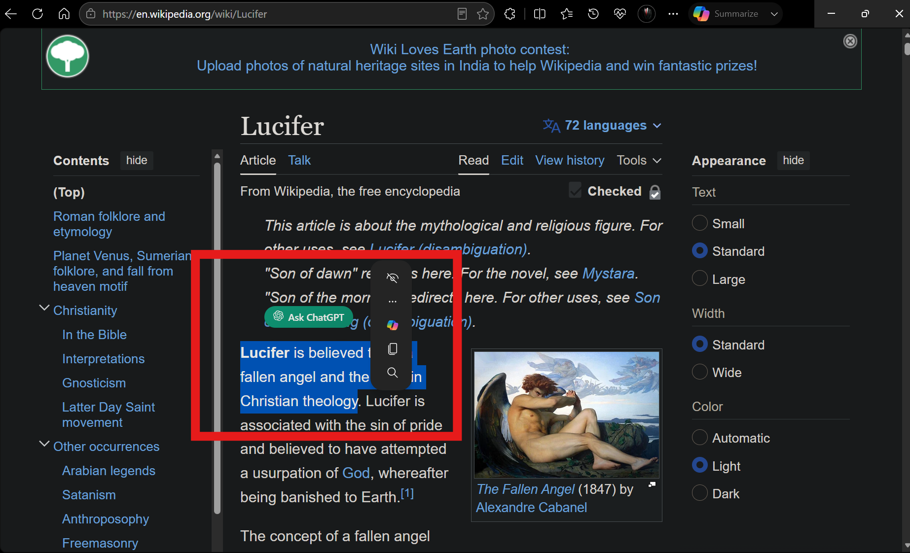
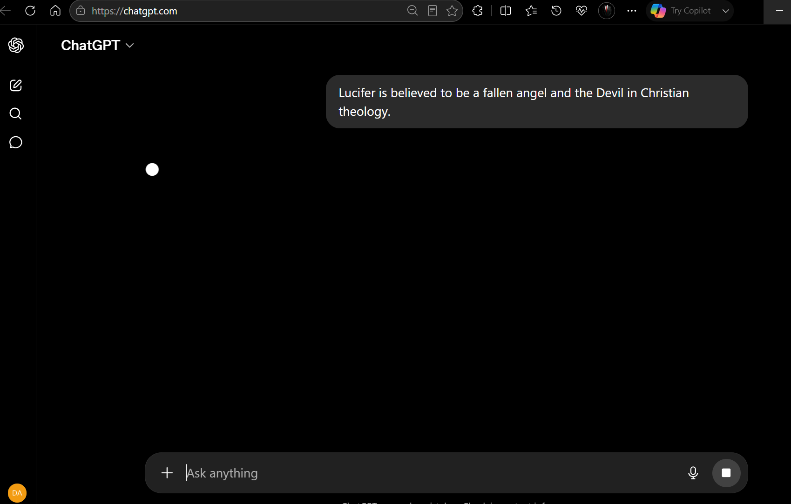

# Ask AI — Browser Assistant

> Highlight any text on any webpage and send it instantly to ChatGPT, Gemini, or Perplexity in one click.


---

## What it does

Ask AI is a browser extension that reduces the copy-paste-tab-switch workflow while researching, studying, or reading online.

Instead of:

Copy → Open AI website → Paste → Type prompt → Send

You can simply:

Select Text → Click Ask AI → Get an AI response

Supported platforms:

- ChatGPT
- Gemini
- Perplexity

---

## How it works

The extension is built around three main parts:

```text
[User selects text]
       ↓
[popup-bar.js — floating button injected on webpages]
       ↓
[background.js — service worker reads the selected provider and routes the request]
       ↓
[pendingPrompt stored in chrome.storage.local]
       ↓
[autosend-{provider}.js runs on the AI tab]
       ↓
[Prompt is inserted into the editor and submitted automatically]
```

Each AI platform has its own editor behavior, so the extension uses provider-specific automation logic instead of one universal selector.

| Platform | Editor Type | Injection Approach |
|---|---|---|
| ChatGPT | React + ProseMirror contenteditable | `InputEvent("beforeinput")` + `textContent` fallback |
| Gemini | `<textarea>` or contenteditable | Dual-path detection with a fallback strategy |
| Perplexity | React-controlled `<textarea>` / textbox | Native value setter and input events |

---

## Features

- Floating Ask AI button near selected text
- Right-click context menu support
- Multi-AI routing
- Provider selection through an options page
- ChatGPT support
- Gemini support
- Perplexity support
- Manifest V3 architecture
- Browser-wide contextual workflow

---

## The build journey

This project did not start as a polished multi-AI extension. It grew in stages.

### v1 — First prototype
The first version was a basic proof of concept. It could capture selected text and send it to ChatGPT. The idea worked, but the implementation was simple and fragile.

### v2 — Multi-provider routing
The next version expanded the extension beyond a single provider. The goal changed from “Ask ChatGPT” to “Ask AI.” The background script started routing requests based on the selected provider.

### v2.3 — Timing and race-condition fixes
Once the extension started opening provider tabs and injecting prompts automatically, timing became the main problem.

The same request could be triggered by multiple events, so the project needed:
- debounce guards
- sending locks
- delayed retries
- safer prompt consumption from storage

This was the point where the architecture became much more reliable.

### v2.3 — CSP and injection fixes
Some pages blocked inline execution or behaved badly with direct script injection. The extension was refactored to use safer message passing and cleaner script flow.

### v2.4 — Browser compatibility fixes
The floating button had to work cleanly across browsers and webpages without colliding with built-in UI or restricted frames. This version focused on layout and compatibility stability.

### v2.5 — Stability and polish
The latest version tightened routing, loading behavior, and autosend reliability so the extension works more consistently across supported providers.

---

## Why I built it

I wanted a faster way to ask an AI assistant about text while reading online.

The usual flow is annoying:

1. Highlight text
2. Copy it
3. Open an AI site
4. Paste it
5. Write a prompt
6. Send

This extension reduces that to one action.

---

## Installation

### Developer mode install

1. Download or clone this repository.
2. Open Chrome or Edge.
3. Go to `chrome://extensions/`.
4. Turn on **Developer mode**.
5. Click **Load unpacked**.
6. Select the project folder.
7. Use the extension icon to choose your provider in the options page.

> Note: `node_modules/` is included only for development and tests. It is not required by the browser at runtime.

---

## Project structure

```text
Ask-AI-Browser-Assistant/
├── manifest.json          # Extension manifest
├── background.js          # Service worker and routing logic
├── popup-bar.js           # Floating button injected on webpages
├── autosend-chatgpt.js    # ChatGPT automation logic
├── autosend-gemini.js     # Gemini automation logic
├── autosend-perplexity.js # Perplexity automation logic
├── popup.html / popup.js  # Toolbar popup UI
├── options.html / options.js # Provider selection and settings
├── icons/                 # Extension icons
└── README.md              # Project documentation
```

---

## Known limitations

- AI websites occasionally change their DOM structure, so selectors may need updates over time.
- Some providers can behave differently depending on whether the editor is a textarea or a contenteditable box.
- Browser security rules and page loading timing can affect automation reliability.

---

## Tech stack

JavaScript (ES2022) · HTML · CSS · Chrome Extensions Manifest V3 · `chrome.storage` · `chrome.tabs` · `chrome.scripting` · `chrome.contextMenus` · Content Scripts · Service Workers

---

## What I learned

Building this project taught me a lot about:

- Browser extension development
- Manifest V3 service workers
- Runtime messaging
- Content script injection
- Browser security rules
- Timing and race conditions
- Debugging real-world UI automation

The biggest lesson was that a simple idea can still turn into a serious engineering project once you make it reliable.

---

## Built with AI-assisted development

This project was built using AI-assisted development workflows.

I used AI agents to help generate code, debug issues, explore options, and speed up iteration. I still reviewed, tested, and validated the results during the build process.

I mainly know C and Python, so this extension was a practical way to learn browser extension development while using AI as a coding partner.

---

## Screenshots

### Selecting Text and Ask Button




### Prompt Auto Send




## Demo

Add a GIF here:


---

## License

MIT
